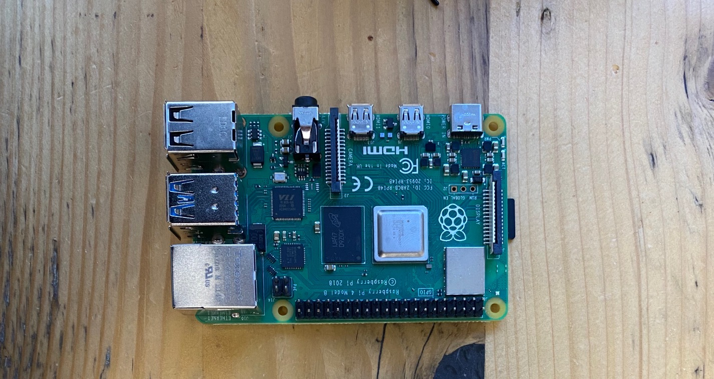
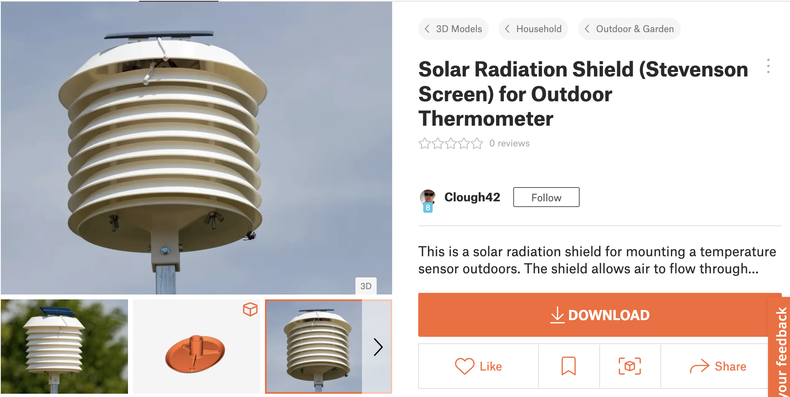
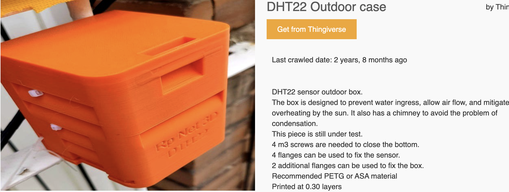

# CASA0016-Air Quality Monitoring Station by Leo Liu 

## - Main Hardware Components

- ### [An Arduino Uno R3](https://shop.pimoroni.com/products/arduino-uno-rev3?variant=3092610678794), which is used as the microcontroller board for this project and can be connected through Wi-Fi communication.
- ### [A PMS5003 particulate matter sensor with cable](https://coolcomponents.co.uk/products/pm2-5-air-quality-sensor-and-breadboard-adapter-kit-pms5003), which senses particulates of various sizes (PM1, PM2.5, PM10) from sources like smoke, dust, pollen, metal and organic particles.
- ### [An I2C 16x2 Arduino-compatible LCD Display](https://thepihut.com/products/i2c-16x2-arduino-lcd-display-module?variant=27740631761&currency=GBP&utm_medium=product_sync&utm_source=google&utm_content=sag_organic&utm_campaign=sag_organic&gclid=Cj0KCQiAj4ecBhD3ARIsAM4Q_jEPRQ0tJKdw66-0kLN20LmP5OWzxONd0NJJs3dVoUGy7qriAn9igzgaAnyfEALw_wcB), which is used to display the live data.
- ### [A DHT22 temperature/humidity sensor](https://thepihut.com/products/dht22-temperature-humidity-sensor-extras?variant=27740418129&currency=GBP&utm_medium=product_sync&utm_source=google&utm_content=sag_organic&utm_campaign=sag_organic&gclid=CjwKCAjwtp2bBhAGEiwAOZZTuF0XQfJresicn_DwyArRHfgDXQoU8I8vx1WCKW8TAyW2_viN2bb0choC5kcQAvD_BwE), which returns temperature and humidity readings.

- ### [An Adafruit SGP30 TVOC/eCO2 Gas Sensor](https://learn.adafruit.com/adafruit-sgp30-gas-tvoc-eco2-mox-sensor), which detects a wide range of Volatile Organic Compounds (VOCs) and H2 for indoor air quality monitoring. This sensor calculates TVOC and its equivalent carbon dioxide (eCO2) values. TVOC (total volatile organic compounds) represents the entire pool of pollutants from static and variable sources (Holøs et al., 2018). Construction materials, fittings, equipment and surface treatments belong to the static. Residents or resident-related activities such as using cleaning compounds or bringing in new objects are variable sources. Both sources have the highest impacts at the start of a building’s service life. Therefore, the concentration of TVOC in a newly furnished building follows a multi-exponential decay trend over time after the construction is complete (Holøs et al., 2018). 

- ### [A Raspberry Pi](https://thepihut.com/products/raspberry-pi-4-model-b), which can be used as a data store and upload the data to the CASA MQTT server. 

 

> ## Project Objective 
>   The purpose of this project is to provide a worked-out example of how to build an air quality monitoring system. The initial deployment of my air quality monitoring station will be in the Connected Environments Lab. I will use Raspberry Pi to share my live data on the CASA MQTT server, then use Influx DB and Grafana to graph the data. I will also try to deploy my air quality monitoring station in the other rooms of this building to compare results.
 Since One Pool Street is a new building and is the first building of the new project UCL East campus, it would be interesting to find out if its TVOC level is in the acceptable range or not. Flushing as much fresh air through the building as possible is the best way to clear out toxic Volatile Organic Compounds (VOCs), such as temporarily increasing the ventilation rate or the fresh air change rate, to counter the high pollutant-load from off-gassing of volatile compounds from new materials in the building.     

>  

# - Next Steps...
1. Set up Rasberry Pi and connect to MQTT.
2. Focus on interior and exterior design (e.g. circuit wiring, packaging, enclosures etc) to make the quality of the build more sophisticated.

3. Consider the possibility of outdoor deployment: power (battery, solar power, or cable), waterproof, LoRa?

## - References
> 
- Holøs, S.B. et al. (2018) “VOC emission rates in newly built and renovated buildings, and the influence of ventilation – a review and meta-analysis,” International Journal of Ventilation, 18(3), pp. 153–166. Available at: https://doi.org/10.1080/14733315.2018.1435026. 
> 