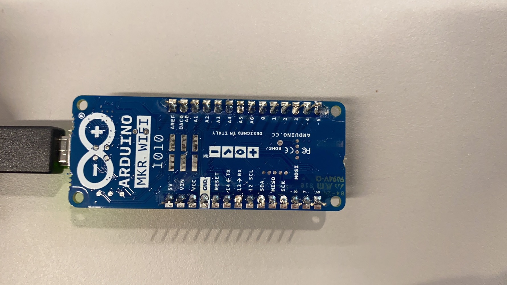

# CASA0016-Air Quality Monitoring Station by Leo Liu 

> ## Project Objective 
>   The purpose of this project is to provide a worked-out example of how to build an indoor air quality monitoring system (temperature, humidity, pm2.5, TVOC, and its equivalent carbon dioxide (eCO2) values). The initial deployment will be in the Connected Environments Lab in One Pool Street. It would be worthwhile to examine the air quality in the lab, since CE staff and students are having regular meetings in this newly furnished room.

> 

## - Main Hardware Components

- ### [Arduino MKR WiFi 1010](https://thepihut.com/products/arduino-mkr-wifi-1011?variant=32106770464830&currency=GBP&utm_medium=product_sync&utm_source=google&utm_content=sag_organic&utm_campaign=sag_organic&gclid=CjwKCAiAp7GcBhA0EiwA9U0mtrhYRhqejY5YdluLdDMJ-_NmuugGVmjQox3zMxMjW3hzbZ6OASWcKxoCYxIQAvD_BwE) is used as the microcontroller board for this project. It can be connected through Wi-Fi communication and is smaller in size.

- ### [A DHT22 temperature/humidity sensor](https://thepihut.com/products/dht22-temperature-humidity-sensor-extras?variant=27740418129&currency=GBP&utm_medium=product_sync&utm_source=google&utm_content=sag_organic&utm_campaign=sag_organic&gclid=CjwKCAjwtp2bBhAGEiwAOZZTuF0XQfJresicn_DwyArRHfgDXQoU8I8vx1WCKW8TAyW2_viN2bb0choC5kcQAvD_BwE), which returns temperature and humidity readings.

- ### [A PMS5003 particulate matter sensor with cable](https://coolcomponents.co.uk/products/pm2-5-air-quality-sensor-and-breadboard-adapter-kit-pms5003) is used to sense particulates of various sizes (PM1, PM2.5, PM10) from sources like smoke, dust, pollen, metal and organic particles.

- ### [An Adafruit SGP30 TVOC/eCO2 Gas Sensor](https://learn.adafruit.com/adafruit-sgp30-gas-tvoc-eco2-mox-sensor), is used to calculate TVOC and its equivalent carbon dioxide (eCO2) values. This sensor detects a wide range of Volatile Organic Compounds (VOCs) and H2 for indoor air quality monitoring.
>   Total volatile organic compounds (TVOC) include pollutants from static sources and variable sources (Holøs et al., 2018). Construction materials, fittings, equipment and surface treatments belong to static sources. Residents or resident-related activities such as using cleaning compounds or bringing in new objects are variable sources. Both sources have highest impacts at the start of a building’s service life, therefore, the concentration of TVOC in a newly furnished building follows a multi-exponential decay trend over time after the construction is complete (Holøs et al., 2018). 

- ### [An I2C 16x2 LCD Display](https://thepihut.com/products/i2c-16x2-arduino-lcd-display-module?variant=27740631761&currency=GBP&utm_medium=product_sync&utm_source=google&utm_content=sag_organic&utm_campaign=sag_organic&gclid=Cj0KCQiAj4ecBhD3ARIsAM4Q_jEPRQ0tJKdw66-0kLN20LmP5OWzxONd0NJJs3dVoUGy7qriAn9igzgaAnyfEALw_wcB) is used to display the live sensor data locally as an integral part of the system. The Arduino-compatible LCD screen is ideal for displaying text, numbers, and special characters of the live data. 

## - Components Assemblage

- The hardware components are connected to Arduino MKR through jumping wires.

- Wago lever connectors.

- A copper stripboard is used to create more pins and organize the wires.
- Each row on the copper stripboard is designed for a specific pin.

- A serial data communication employing I2C (Inter-Integrated Circuit) master/slave bus controller is implemented for SGP30 and the I2C LCD. 
- Unlike traditional data transfer bus systems (USB, SPI, Microwire, and UARTS), I2C requires only two wires (SDA and SCL) to transmit information between devices connected to the bus (Kaneriya & Jagtap, 2015).

Flushing as much fresh air through the building as possible is the best way to clear out toxic Volatile Organic Compounds (VOCs), such as temporarily increasing the ventilation rate or the fresh air change rate, to counter the high pollutant-load from off-gassing of volatile compounds from new materials in the building.

## - References
> 
- Holøs, S.B. et al. (2018) “VOC emission rates in newly built and renovated buildings, and the influence of ventilation – a review and meta-analysis,” International Journal of Ventilation, 18(3), pp. 153–166. Available at: https://doi.org/10.1080/14733315.2018.1435026. 

- Kaneriya, H. and Jagtap, S. (2015) “Design Of I2C Master With Multiple Slave”, International Journal on Recent and Innovation Trends in Computing and Communication, 3(5), pp. 2890–2893. Available at: https://doi.org/10.17762/ijritcc.v3i5.4356.
> 
